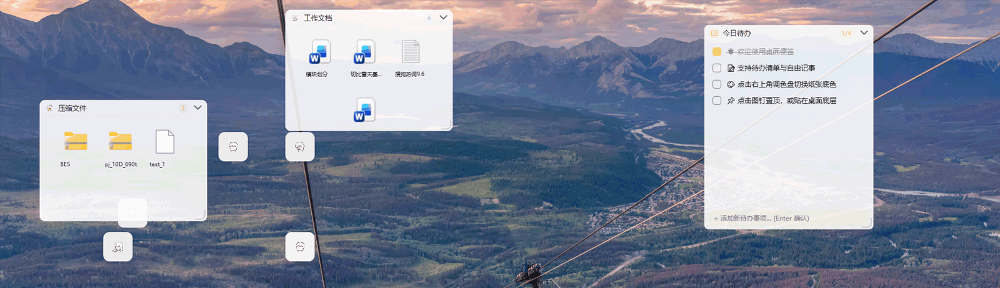
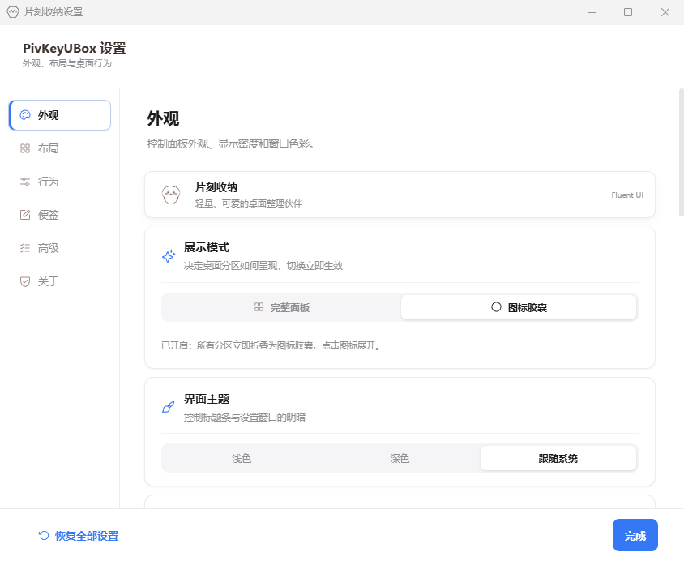
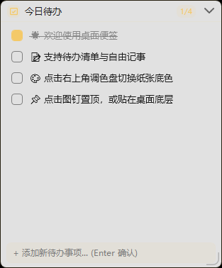
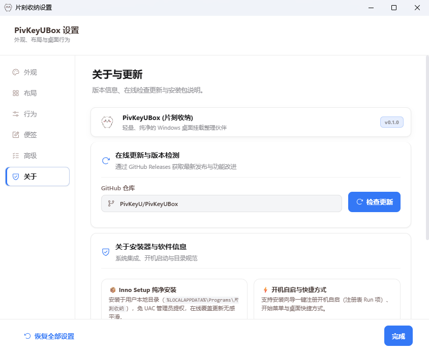
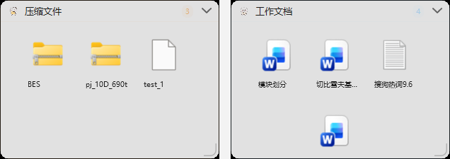

<div align="center">
  
  <h1>PivKeyUBox</h1>
  <p><strong>A lightweight organizer that lives directly on the Windows desktop layer — quiet, native, and never bloated.</strong></p>
  <p>
    
    <a href="#license"></a>
    <a href="https://github.com/PivKeyU/PivKeyUBox/releases"></a>
    
    
    
    
    
  </p>
  <p><a href="README.md">简体中文</a> | <a href="README.en.md">English</a></p>
</div>

<div align="center">
  
</div>

---

## What is this

PivKeyUBox (Chinese name「片刻收纳」) mounts file-organizing Panels directly onto the Windows desktop layer (`SHELLDLL_DefView` / `Progman`) — **you never open a window; the desktop itself is the workspace.**

Every Panel and every Sticky Note is an independent native WPF window, with its UI rendered by React 19 + TypeScript inside the WebView2 runtime that already ships with Windows. **No bundled Electron, no bundled Chromium** — the installer is roughly 8 MB, and cold start only has to bring up WPF plus the system WebView2.

> Design principle: **one less resident runtime, one more quiet desktop.** Organizing only ever moves files, never deletes them, and every batch can be undone.

---

## Why PivKeyUBox

| | PivKeyUBox | Electron-based desktop widgets | Native desktop icons | Traditional file organizers |
| --- | --- | --- | --- | --- |
| Runtime footprint | Zero Chromium runtime; reuses the system WebView2 | Ships a full Chromium; installers in the hundreds of MB | No extra runtime | Depends on implementation |
| Memory | **Native windows on demand**: Panels are native WPF windows; only the settings window uses WebView2, and its working set is trimmed as soon as it closes | Resident multi-process Chromium; shared engine, but a higher baseline | Handled by Explorer | Usually always resident |
| Disturbs desktop icon layout | No. Owner targets an existing `SHELLDLL_DefView`; **never creates `WorkerW`** | Varies; some approaches hijack the desktop layer | Yes (icons are the files) | No, but also not on the desktop layer |
| File semantics | Windows Shell: `IFileOperation` with the native progress dialog and undo support | Usually a custom file-move implementation | The file system itself | Usually a custom implementation |
| Move-only, never delete | Yes. Move/copy only, **never deletes** | Inconsistent | Manual user action | Varies |
| Name collisions | Appends ` (1)`, ` (2)`; never overwrites | Inconsistent | System prompt | Varies |
| Batch undo/redo | Up to 30 batches of history, undoable/redoable from Settings (Advanced) | Rare | Recycle Bin | Varies |
| Focus stealing | Clicking a Panel while another app is foreground does not steal focus; transient raise only during a raise session | Commonly steals focus | N/A | Varies |
| Install privileges | Inno Setup `PrivilegesRequired=lowest` — **no UAC**, installs per user | Depends on packaging; often prompts for UAC | No install | Often requires admin |

---

## Core features

### 1. Desktop-layer mounting: on the wallpaper, not above it

A Panel's owner window targets Explorer's existing desktop icon view `SHELLDLL_DefView`, and the result is **read back for verification**. If the desktop is not ready yet, it falls back to `Progman` and upgrades automatically once the desktop becomes available (the upgrade thread gives up after about 60 seconds instead of polling forever).

- **`WorkerW` is never created**: this avoids fighting Explorer's icon-layout restore, so icons do not get scrambled during sign-in.
- **Self-heals after Explorer restarts**: the host listens for the `TaskbarCreated` broadcast, invalidates its handle cache, re-mounts every Panel, and re-registers the tray icon (`NotifyIcon` does not come back on its own).
- All mounting and Z-order operations use `SWP_NOACTIVATE`, so adjusting layers never activates or flickers a window.

### 2. Window lifecycle and focus safety

A single left-click on the tray icon (which toggles all Panels) starts a **raise session**: the whole group floats to the top of the normal Z-band using an atomic "raise everyone transiently, then clear in reverse order" sequence — this is **not persistent `TopMost`**, so other windows can still cover it normally.

When the user leaves, a restore monitor sends the whole group back to the desktop layer at once, combining three edge signals in a fixed priority order:

| Signal | Meaning |
| --- | --- |
| `own-foreground-leave` | A Panel (or another owned window) took foreground and then lost it — the most reliable primary path |
| `foreground-changed` | Activation never succeeded, but the foreground window changed — a legitimate outcome given foreground-lock restrictions |
| `outside-click` | 50 ms high-frequency `GetAsyncKeyState` mouse-edge sampling, catching cross-process clicks |

Three more safeguards wrap it up: a 160 ms suppression window right after raising, an interaction-depth counter (dragging/resizing/menus block the fallback), and a leaked-interaction watchdog that force-resets after 10 seconds without owned foreground. **Clicking a Panel while another app is foreground does not steal system focus.**

### 3. System material backdrop and theming

The material is handled per platform: on Windows 10 1809 (build 17134) through 21999, `SetWindowCompositionAttribute` applies `ACCENT_ENABLE_ACRYLICBLURBEHIND` so Windows DWM blurs the wallpaper behind the panel surface — a system-level material, not a CSS imitation. Starting with Windows 11 (build ≥ 22000), the SWCA acrylic backdrop is painted as the window's **rectangle**, ignoring per-pixel alpha and the window region, so the white fog leaks out of the four corners outside the rounded corners; the app therefore **disables it on Windows 11** and the glass look is carried by the **WPF gradient layer** instead.

- Older builds (build < 17134) fall back to `ACCENT_ENABLE_BLURBEHIND` (plain blur), and if the `SetWindowCompositionAttribute` call fails it falls back again to a solid gradient, so the UI never collapses visually.
- Light / dark / follow-system themes, five color schemes (Pure White, Warm Paper, Powder Blue, Mint, Sakura) plus fully custom accent and surface colors.
- Opacity, UI scale, compact density, icon size, label position, and grid/list views are all adjustable.

<div align="center">
  
</div>

### 4. Native Shell file semantics and file protection

- **Interactive imports (drag into a Panel / moves from settings)**: `IFileOperation` runs in batch on a dedicated STA thread, giving you the **native system progress dialog** and operations that can be undone from File Explorer.
- **Background organizing (silent mode)**: same-volume moves use `File.Move` (rename semantics — atomic and fast); when a cross-volume move fails with `ERROR_NOT_SAME_DEVICE`, that entry falls back to a silent Shell batch (`FOF_SILENT | FOF_NOCONFIRMATION | FOF_NOERRORUI`).
- **Move only, never delete**: the manual "Organize desktop..." flow shows the pending move list and waits for confirmation; automatic organizing only runs when explicitly enabled and only handles files that have been stable for a while.
- **No overwriting**: if the destination exists, it tries "Name (1)", "Name (2)", and so on; a reserved-path set inside each batch prevents collisions between items in the same run.
- **Send back to desktop**: right-click a file inside a Panel to move it back to the desktop (the same native bridge, same-volume rename).

### 5. Sticky Notes and to-dos

Sticky Notes are native windows with two interchangeable modes and in-place title renaming by double-click:

- **To-do mode**: check off items, delete single items, clear all completed at once (the menu shows how many are done), and a quick-entry bar at the bottom.
- **Free-form memo mode**: plain-text notes with a 400 ms debounce that persists automatically.
- **Capsule collapse**: collapses to a 30 px bar (title plus completion progress) or to a 48×48 mini icon whose badge shows the number of outstanding to-dos (capped at `99+`).
- **Pin on top / stay on the desktop bottom layer**: pinning uses real `Topmost`; unpinning re-mounts the window on the desktop layer.
- **Many creation entry points**: the system tray, a Panel's title-bar context menu, the "+" button inside a Note, and an optional **Windows desktop background context menu** (registry key `HKCU\Software\Classes\Directory\Background\shell\PivkeyNotes`, deleted automatically when the switch is turned off).

<div align="center">
  
</div>

### 6. Icon Capsule mode

With Capsule mode on, a collapsed Panel is no longer a thin bar but a **56×56 desktop icon** (Notes collapse to 48×48). Click a Capsule to expand it, drag a Capsule to move it — the two gestures are told apart by a movement threshold. Collapsing and expanding animate over 210 ms, and expanding nudges neighboring Panels aside so content never overlaps.

<div align="center">
  
</div>

### 7. Quick search and desktop context menu

- **Quick search window** (`Ctrl + Alt + F`): a lightweight WPF window that **does not spin up a second WebView2** and is only created when the hotkey is pressed; search by name, path, or category, `Enter` to open, `Esc` to close.
- **Global hotkeys**: `Ctrl + Alt + Q` toggles click-through, `Ctrl + Alt + S` opens settings, `Ctrl + Alt + F` opens quick search.
- **In-Panel search**: the search button in a Panel's title bar expands an inline filter box.

### 8. UAC-free installation and online updates

- **Inno Setup `PrivilegesRequired=lowest`**: installs to `%LOCALAPPDATA%\Programs\PivKeyUBox` by default with no UAC prompt.
- Before install and before uninstall, the installer `taskkill`s any lingering `PivKeyUBox.exe / PivkeyOrganizer.exe / ShellMenu.exe`.
- Optional **`HKCU\...\CurrentVersion\Run`** autostart and optional desktop shortcut, both cleaned up on uninstall.
- **Online updates**: a native C# updater talks directly to `https://api.github.com/repos/PivKeyU/PivKeyUBox/releases/latest`, does semantic version comparison, shows the release notes, and reports async download progress; when done it upgrades in place with `/SILENT /CLOSEAPPLICATIONS`, **preserving all user configuration and data**.

<div align="center">
  
</div>

### 9. More capabilities

| Capability | Description |
| --- | --- |
| Magic color | When enabled, a Panel's color is driven by the **most prevalent** file kind inside it (Capsule, swatch, and title bar follow the content) |
| Workspace presets | Three built-in layouts (Office / Gaming / Development) plus custom snapshots of positions, sizes, collapse, pin, view and sort modes |
| Custom classification rules | Match by extension, name wildcard, or path; rules are evaluated top-down by priority |
| Config import/export | Export categories, rules and layout as JSON, or import to overwrite in one click |
| Auto scan and auto organize | Configurable delay (5–60 s) that only moves files whose state has settled; paused while you interact |
| Click-through | `Ctrl + Alt + Q` toggles `WS_EX_TRANSPARENT` so clicks pass straight through to the desktop |
| Organize history | Up to 30 batches of operations with undo and redo |

---

## Gallery

| Panels | Sticky Note |
| --- | --- |
|  |  |

| Icon Capsules | Settings · Appearance | Settings · About |
| --- | --- | --- |
|  |  |  |

---

## Architecture

```text
┌──────────────────────────────────────────────────────────────┐
│  Windows desktop layer (Explorer)                            │
│  SHELLDLL_DefView (preferred) -> Progman (fallback)          │
│  * Never creates WorkerW  * Re-mounts on TaskbarCreated      │
└───────────────────────────┬──────────────────────────────────┘
                            │ HWND owner mounting + SWP_NOACTIVATE Z-order
┌───────────────────────────▼──────────────────────────────────┐
│  Native host (C# 5 / WPF / .NET Framework 4.7.2)             │
│  * PivkeyHost.cs  host, tray, hotkeys, WebView2 env          │
│  * Manager.cs  scan/classify/plan/config/panel sync          │
│  * PanelWindow.cs  Panel window (collapse/capsule/view)      │
│  * NoteWindow.cs  Sticky Note and to-do window               │
│  * WidgetLayer.cs  desktop mounting + Z-order protocol       │
│  * LayerSession.cs  raise session + restore monitor          │
│  * NativeFileOps.cs  IFileOperation / File.Move bridge       │
│  * UpdateManager.cs  GitHub Releases check/download          │
│  * ShellMenu.exe  out-of-process context-menu helper         │
└───────────────────────────┬──────────────────────────────────┘
                            │ WebView2 (system runtime, not bundled)
┌───────────────────────────▼──────────────────────────────────┐
│  React 19 + TypeScript UI layer                              │
│  App.tsx - components/ - hooks/ - state/ - utils/            │
│  * Settings / About & updates / layout preview / icons       │
│  * Only the settings window uses WebView2 (trimmed)          │
└───────────────────────────┬──────────────────────────────────┘
                            │ postMessage JSON RPC (with source checks)
┌───────────────────────────▼──────────────────────────────────┐
│  Native RPC bridge (services/nativeDesktop.ts)               │
│  scanDesktop / executeOrganization / restoreOrganization     │
│  createNote / deleteNote / setInteractiveRegions / ...       │
└──────────────────────────────────────────────────────────────┘
```

| Layer | Technology | Notes |
| --- | --- | --- |
| Desktop mounting | Win32 (`SetWindowPos` / `EnumWindows`) | Owner targets `SHELLDLL_DefView` with read-back verification, falling back to `Progman` |
| Native host | C# 5 + WPF (`csc /langversion:5 /platform:x64`) | Compile-time dependencies limited to .NET Framework 4.7.2 and the WebView2 SDK |
| Material | `SetWindowCompositionAttribute` + `ACCENT_ENABLE_ACRYLICBLURBEHIND` | Windows 10 1809–21999 uses real DWM acrylic; Windows 11 disables SWCA acrylic (painted as a rectangle, leaking at the rounded corners), so the glass look comes from the WPF gradient layer; older builds fall back to `ACCENT_ENABLE_BLURBEHIND` |
| File operations | `IFileOperation` (dedicated STA thread) + `File.Move` | Interactive operations go through Shell (undoable); silent organizing prefers rename |
| UI rendering | React 19 + TypeScript + Vite 6 | `dist/` is copied into `release/PivKeyUBox/web` |
| Host container | Microsoft Edge WebView2 (system runtime) | `--renderer-process-limit=1`, settings and migration pages share one renderer |
| Icons | `@phosphor-icons/react` + embedded SVG paths | Native menus and the web UI share the same icon semantics |
| UI typography | System UI fonts (Microsoft YaHei UI / Segoe UI Variable Text) | Managed font resources ship with the package, falling back to system fonts |
| Tests | Vitest | 6 test files: classifier, panel layout, panel sync, preferences, magic color, category validation |
| Packaging | PowerShell + `csc.exe` + Inno Setup 6 | Produces the portable directory, ZIP and single-file installer in one run |
| Auto update | GitHub Releases API + Inno Setup `/SILENT` | Version compare, release notes, progress, in-place upgrade |

---

## Quick start

### Requirements

| Item | Requirement |
| --- | --- |
| OS | Windows 10 (1809+) or Windows 11 |
| Runtime | .NET Framework 4.7.2+ (usually already present on Windows 10 1809+) |
| WebView2 | Microsoft Edge WebView2 Runtime (preinstalled on Windows 11) |
| Node.js (source builds only) | Node.js 18+ recommended, for Vite and Vitest |
| Inno Setup (installer builds only) | Inno Setup 6, e.g. `winget install JRSoftware.InnoSetup` |

### Option 1: Download the installer (recommended)

Grab the latest release from the [Releases page](https://github.com/PivKeyU/PivKeyUBox/releases):

- `PivKeyUBox-Setup-v0.1.0.exe` — single-file wizard installer, about 8 MB, **no UAC**, installs into your user profile.
- `PivKeyUBox-win-x64.zip` — portable archive; unzip and run `PivKeyUBox.exe`.

Once installed, the app lives in the system tray: double-click the tray icon to open Settings, single left-click toggles all Panels on and off.

### Option 2: Build from source

```powershell
# Install dependencies (React 19 + Phosphor Icons + Vite/Vitest)
npm install

# Start the front-end dev server (http://127.0.0.1:5173)
# Browser mode uses built-in mock data and never touches the real desktop
npm run dev

# Build the web assets, compile the native host, then launch the desktop app
# Pipeline: tsc -b && vite build → scripts\build-windows.ps1 → start release\PivKeyUBox\PivKeyUBox.exe
npm run desktop

# Build only the portable artifacts (release\PivKeyUBox\ plus release\PivKeyUBox-win-x64.zip)
npm run package

# Build the Inno Setup installer (release\PivKeyUBox-Setup-v<version>.exe)
# ISCC.exe is located via PATH → %LOCALAPPDATA%\Programs\Inno Setup 6 → Program Files
npm run installer

# Run the unit tests (Vitest, 6 test files)
npm test
```

> The packaging script downloads the WebView2 SDK from NuGet and verifies it against a **SHA256 checksum** (`1.0.4078.44`), and it stops any running `PivKeyUBox / PivkeyOrganizer / ShellMenu` processes before compiling so files under `release\` are not locked.

---

## Usage guide

### Tray menu

Right-click the PivKeyUBox icon in the notification area:

| Item | What it does |
| --- | --- |
| Organize desktop... | Scans the desktop, shows the pending move list, and organizes after confirmation (moves only, never deletes) |
| New Panel | Opens the "New Panel" dialog to define name, extensions, color, and whether folders are accepted |
| New to-do list | Creates a to-do Sticky Note on the desktop |
| New memo | Creates a free-form Sticky Note on the desktop |
| New folder mapping | Opens the system folder picker and uses the chosen folder's name (appending ` (1)`, ` (2)` on collisions) to create a Panel that accepts every extension and folders |
| Add feature Panel | Identical to "New Panel" — it opens the same "New Panel" dialog |
| Open storage folder | Opens `Desktop\片刻收纳` in File Explorer |
| Settings | Opens the settings window (also `Ctrl + Alt + S`) |
| Exit | Quits the app (it is a tray-resident app — closing windows does not exit the process) |

**Tray behavior**: single left-click toggles all Panels; double-click opens Settings.

**Portal Panels**: a genuinely reference-only Panel is created in **Settings → Layout → category → Folder portal**; a portal Panel always references files without moving them, and organizing never moves anything inside it.

### Panel interactions

- **Title bar**: drag to move, double-click to collapse/expand, right-click for the full menu.
- **Context menu**: rename Panel, pin to desktop/unpin, collapse/expand, new to-do list, new memo, open folder, refresh Panel, plus the "View and sort" submenu (grid view / list view / sort by name, time, or size).
- **Resizing**: eight-direction border resize with a grip in the bottom-right corner, hidden while collapsed or in Capsule mode.
- **File drop**: drag files from File Explorer into a Panel; the border glows in the theme color while hovering. Hold `Ctrl` to copy, or drag with the right mouse button for a "move / copy here" choice menu.
- **File actions**: open, reveal original location, send back to desktop, batch-move into this Panel, and the real Windows context menu (hosted by the separate `ShellMenu.exe` process so a crash never takes down the main app).
- **Auto hide**: configurable 1–10 second delay after leaving; never triggers while pinned or collapsed.

### Sticky Notes and to-dos

| Action | How |
| --- | --- |
| Create | Tray menu, Panel title-bar context menu, the "+" button in a Note, or the Windows desktop background context menu |
| Switch mode | The "⇄" button in the title bar, or the context menu item "Switch to to-do list / Switch to memo" |
| Rename | Double-click the title, or the context menu item "Rename Note" |
| Pin | The pin button in the title bar, or the context menu item "Pin on top / Unpin" |
| Collapse | The collapse button in the title bar; the collapsed shape follows "Note capsule mode" in Settings (bar or mini icon) |
| Clear completed | In to-do mode, the context menu item "Clear completed items (n)" |
| Delete | The context menu item "Delete this Note" (with a confirmation dialog) |

---

## Project structure

```text
PivKeyUBox/
├── native/                            # Windows native host (C# 5 / WPF / .NET Framework 4.7.2)
│   ├── PivkeyHost.cs                  # Host window, tray menu, global hotkeys, WebView2 env, single-instance wake
│   ├── Manager.cs                     # Scan / rules / organize plans / config persistence / Panel & Note sync
│   ├── PanelWindow.cs                 # Panel window: collapse, capsule, view & sort, drag-and-drop, resize
│   ├── NoteWindow.cs                  # Sticky Note and to-do list window
│   ├── WidgetLayer.cs                 # Desktop mounting and Z-order protocol (read-back verified, upgradeable fallback)
│   ├── LayerSession.cs                # Raise session and three-signal restore monitor
│   ├── NativeFileOps.cs               # IFileOperation / File.Move native file bridge
│   ├── UpdateManager.cs               # GitHub Releases version check and installer download
│   ├── ShellMenu.cs                   # Out-of-process native context-menu helper (ShellMenu.exe)
│   ├── ShellLauncher.cs               # Shell-semantics launcher that borrows the Explorer host
│   ├── CategoryDialog.cs              # "New Panel" dialog
│   ├── ConfirmDialog.cs               # Modern confirmation dialog
│   ├── QuickSearchWindow.cs           # Quick search window (Ctrl + Alt + F)
│   ├── SettingsWindow.cs              # Settings window (WebView2 container + JSON RPC routing)
│   ├── FontResources.cs               # UI font resolution with fallback
│   ├── PivkeyOrganizer.exe.config      # Runtime version declaration (.NET Framework 4.7.2)
│   └── PivkeyOrganizer.manifest        # asInvoker + PerMonitorV2 + longPathAware
├── src/                               # React 19 + TypeScript UI layer
│   ├── App.tsx                        # Root component: state orchestration, native bridge, mode routing
│   ├── main.tsx                       # Entry mount
│   ├── styles.css                     # All UI styles (Fluent card language)
│   ├── types.ts                       # Shared type contracts between host and UI
│   ├── components/                    # Settings, advanced settings, layout preview, icon picker, modals, toasts
│   ├── hooks/                         # Desktop scan, native shell bridge, panel sync, interactive regions, persisted state
│   ├── services/                      # Native RPC bridge, file classifier, category validation
│   ├── state/                         # Preference persistence, layout modes, theme tokens, magic color, storage keys
│   ├── utils/                         # Panel layout algorithms (adaptive presets/alignment) and sync payloads
│   ├── data/                          # Default Panel definitions and character icon mapping
│   └── assets/                        # Fonts, icons, original hand-drawn character art
├── scripts/                           # Build and packaging automation
│   ├── build-windows.ps1              # Downloads and verifies the WebView2 SDK, compiles host and portable package
│   ├── build-installer.ps1            # Locates ISCC.exe, produces the Inno Setup installer plus SHA256
│   └── installer.iss                  # Inno Setup 6 config (no UAC, autostart, process cleanup)
├── docs/                              # README images
├── index.html                         # WebView2 page entry (with strict CSP)
├── vite.config.ts                     # Vite config (React plugin, fixed port 5173)
├── package.json                       # Scripts and dependencies
└── release/                           # Build output (gitignored)
```

---

## Safety and reliability

- **Move only, never delete**: every organizing action is a move or a copy. Manual organizing first shows the pending list (collapsed to "…and N more items" beyond 8) and waits for confirmation.
- **No overwriting**: existing destinations get ` (1)`, ` (2)` suffixes; a reserved-path set prevents collisions inside the same batch.
- **Atomic config writes with snapshot self-healing**: config is written to a temporary file and swapped in with `File.Replace`, which rotates the previous good config into `config.json.bak`. If the main config is corrupted, it is restored silently from the snapshot with a notice; only if the snapshot is also unusable does it reset to defaults.
- **Debounced persistence**: changes are written after a 180 ms debounce to avoid disk churn during drags; size changes use a separate 160 ms reflow debounce.
- **Updates preserve user data**: the installer targets a per-user location, and both upgrade and uninstall leave your classification rules, Notes, and organized files untouched.
- **UAC-free per-user install**: `PrivilegesRequired=lowest` throughout, with no elevation and no writes to privileged registry locations.
- **Page security boundary**: DevTools, the default context menu, the status bar, zoom control, and host objects are all disabled inside WebView2; navigations are source-checked and untrusted ones are cancelled; `index.html` ships a strict CSP (`connect-src 'none'` — the web UI layer needs no network at all; networking is only used by the native updater).
- **High DPI and long paths**: the manifest declares `PerMonitorV2,PerMonitor` and `longPathAware`; when a DPI change happens mid-drag or mid-resize, the physical size is restored only after the gesture ends.

---

## Build and release flow

1. **Bump the version**: edit `version` in `package.json`, e.g. to `0.2.0` (the installer filename picks up the version automatically).
2. **Build the installer**:

   ```powershell
   npm run installer
   # Produces release\PivKeyUBox-Setup-v0.2.0.exe and prints size and SHA256
   ```

3. **Create a GitHub Release**:
   - Open the [Releases page](https://github.com/PivKeyU/PivKeyUBox/releases) and click **Draft a new release**.
   - Tag it `v0.2.0` (the leading `v` is recommended; the client strips it before comparing).
   - Write the release notes (Markdown — the client displays them verbatim under "About and updates").
   - Upload `release\PivKeyUBox-Setup-v0.2.0.exe` as a release asset.
   - Click **Publish release**.

4. **Client-side update**: Settings → **About and updates** → **Check for updates** hits the `releases/latest` endpoint and shows the new version and release notes; "Download update package" downloads with a progress bar, and "Restart and install now" applies it in place with `/SILENT /CLOSEAPPLICATIONS`.

---

## FAQ

<details>
<summary>I see no Panels on my desktop after launching.</summary>

Panels are laid out near the top-left of the screen by default. Try these steps:

1. Single left-click the tray icon to toggle all Panels on and off, to rule out a hidden state.
2. Open Settings → Layout → screen adaptive preset and pick "Smart balance" or "Right dock" to recompute positions and sizes.
3. If you just switched from multiple monitors to one, off-screen Panels are pulled back into the visible work area — you may want to drag them once afterwards.
4. If Explorer just restarted, the app re-mounts automatically after the `TaskbarCreated` broadcast, usually within a second or two.

</details>

<details>
<summary>Will it scramble my desktop icon layout?</summary>

No. The app **never creates `WorkerW`**; its owner targets the `SHELLDLL_DefView` window Explorer already has (with read-back verification), and it only adjusts the Z-order of its own windows. System icons are never re-laid out. Every Z-order change carries `SWP_NOACTIVATE`, so nothing activates or flickers.

</details>

<details>
<summary>I organized something by mistake — how do I undo it?</summary>

Two ways:

- **One file**: right-click it inside the Panel → "Send back to desktop".
- **A whole batch**: Settings (Advanced) offers "Undo last organize / Redo", keeping up to 30 batches of history. If individual files fail to return because they are in use, the failed list is reported separately.

</details>

<details>
<summary>Do I need to install the WebView2 runtime myself?</summary>

Windows 11 has it preinstalled, and most Windows 10 (1809+) machines already have it through Edge updates. If startup reports that the WebView2 environment could not be created, install the "Microsoft Edge WebView2 Runtime" from Microsoft. The app reuses the system runtime and **never bundles its own Chromium**.

</details>

<details>
<summary>Does it need administrator rights?</summary>

No. The installer uses `PrivilegesRequired=lowest`, installs to `%LOCALAPPDATA%\Programs\PivKeyUBox` by default, and the autostart entry goes into the current user's `HKCU` Run key. The executable manifest declares `asInvoker`.

</details>

<details>
<summary>Why not Electron?</summary>

Because this is a tool that lives on the desktop layer but should feel absent most of the time. Electron brings a full Chromium runtime and a higher memory baseline; here the UI only renders when needed (the settings window and expanded Panels), the host is .NET Framework + WPF, and the container reuses the system WebView2. That keeps the installer at about 8 MB and removes the need for a separate runtime update channel.

</details>

<details>
<summary>How is high DPI and multi-monitor handled?</summary>

The manifest declares `PerMonitorV2,PerMonitor`, and each window converts coordinates using its own monitor's DPI. If a DPI change happens during a drag or resize gesture, the physical size is restored after the gesture ends so the window does not jump mid-move. Panels that end up off-screen on multi-monitor setups are pulled back into the visible work area.

</details>

---

## Roadmap

- [x] Desktop-layer mounting (`SHELLDLL_DefView` preferred, `Progman` fallback, Explorer-restart self-healing)
- [x] System material backdrop (real DWM acrylic on Windows 10, glass carried by the WPF gradient layer on Windows 11) with light/dark/follow-system themes
- [x] Native Shell file operations (`IFileOperation` + cross-volume fallback + no-overwrite)
- [x] Sticky Notes and to-do lists (dual mode, capsule collapse, pin on top)
- [x] Icon Capsule mode
- [x] UAC-free Inno Setup installer with optional autostart
- [x] GitHub Releases update check with in-place silent upgrade
- [x] Quick search window and global hotkeys
- [x] Workspace presets (Office / Gaming / Development + custom snapshots)
- [x] Organize undo/redo history
- [ ] Finer-grained rule editor (regex matching, rule import/export)
- [ ] One-click backup/restore of Notes and organize data
- [ ] UI localization (the interface is currently Simplified Chinese only)

---

## Contributing

Issues and pull requests are welcome.

1. **Fork** the repository and create a topic branch: `git checkout -b feat/your-feature` (`fix/` for bug fixes, `docs/` for documentation).
2. **Develop locally**: run `npm install`, use `npm run dev` for the web UI, and `npm run desktop` to verify real desktop behavior.
3. **Commit style**: follow [Conventional Commits](https://www.conventionalcommits.org/), e.g. `feat: support regex classification rules` or `fix: keep Capsule positions after Explorer restarts`.
4. **Run the tests**: execute `npm test` before submitting, and make sure `npm run build` passes without TypeScript errors.
5. **Native code conventions**: keep C# 5 syntax in `native/` (`csc /langversion:5`), Chinese comments, and UTF-8 without BOM.
6. **Open a PR**: describe the motivation, how you verified it, and the scope of impact, with screenshots or recordings where useful.

---

## Credits

- **[Maple Mono NF CN](https://github.com/subframe7536/maple-font)** — the monospace font resources vendored in this repository (`src/assets/fonts/`). The native host's font resolver (`native/FontResources.cs`) prefers the packaged font files and falls back to system UI fonts when they are missing.
- **[Phosphor Icons](https://phosphoricons.com/)** — the icon system shared by the native windows and the web UI (`@phosphor-icons/react` plus embedded SVG paths).
- **Original hand-drawn characters** — the Panel icons, Note illustrations, and settings artwork are all original assets created for this project.

---

## License

Released under the **MIT License**. See [`LICENSE`](LICENSE) for the full text.

---

<div align="center">
  <sub>If this project helps you, a ⭐ Star would be much appreciated</sub>
</div>
